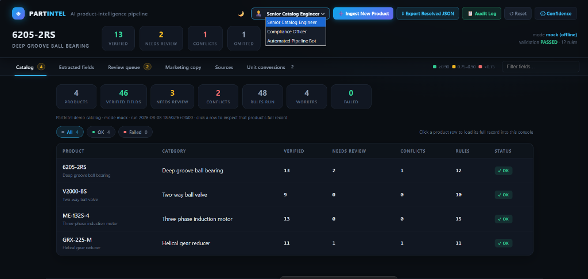
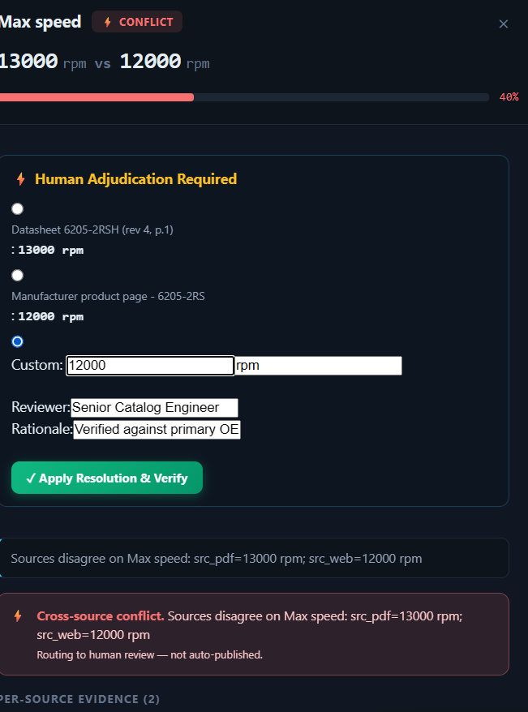
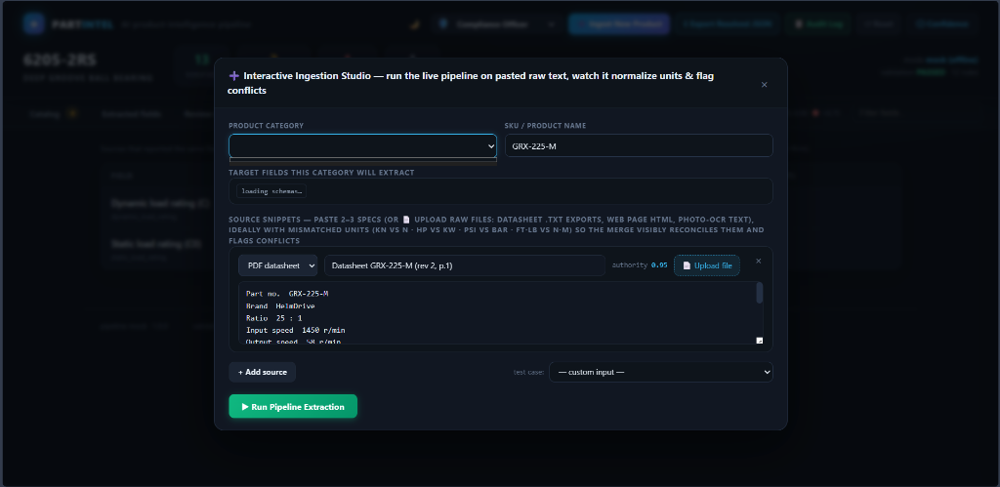

# PartIntel — AI Product-Intelligence Pipeline


*(The Catalog Dashboard processing multiple categories simultaneously)*

**Hackathon deliverable** · Categories: **industrial bearings** (deep groove ball bearing, demo
product **6205-2RS** from SKF 6205-2RSH datasheet + manufacturer web page + photo OCR),
**2-way ball valves** (demo product **V2000-BS**), **electric motors** (demo product
**ME-132S-4** — IEC frame, nameplate OCR) and **helical gear reducers** (demo product
**GRX-225-M**, whose datasheet quotes N·m while the distributor page quotes ft·lb) — the
extra categories prove the whole stack is category-agnostic.

Turns messy, sparse, inconsistent inputs — a PDF datasheet, a manufacturer web page and
an OCR transcript of a product photo — into a **structured, confidence-scored, fully
attributed JSON record** with a clickable explainability UI.


*(Clickable explainability panel proving where every number came from, with manual override workflow)*

```
                   ┌─────────────┐    ┌─────────────┐    ┌─────────────┐
 PDF datasheet     │  pdf parse  │    │  web parse  │    │  ocr parse  │
 (tables)          └──────┬──────┘    └──────┬──────┘    └──────┬──────┘
                          └─────────┐        │        ┌─────────┘
                                    ▼        ▼        ▼
                          ┌──────────────────────────────────────┐
                          │  LLM structured extraction           │
                          │  (one prompt per source, tool-call / │
                          │   JSON mode; exact span citations)   │
                          └──────────────────┬───────────────────┘
                                             ▼
                          ┌──────────────────────────────────────┐
                          │  MERGE  normalization · agreement    │
                          │  · conflict flagging · confidence    │
                          └──────────────────┬───────────────────┘
                                             ▼
                          ┌──────────────────────────────────────┐
                          │  VALIDATE  small rule table (not ML) │
                          └──────────────────┬───────────────────┘
                                             ▼
                          ┌──────────────────────────────────────┐
                          │  ROUTE  conf ≥ 0.75 & no conflict    │
                          │         → verified                   │
                          │         else → needs_review queue    │
                          └──────────────────┬───────────────────┘
                                             ▼
                          ┌──────────────────────────────────────┐
                          │  MARKETING  description that cites   │
                          │  only verified fields                │
                          └──────────────────┬───────────────────┘
                                             ▼
                          output/6205_product.json  →  ui/index.html
```

## Quickstart (zero dependencies)

```bash
# 1. Run the pipeline (auto = real LLM if ANTHROPIC_API_KEY / OPENAI_API_KEY
#    is set, otherwise the deterministic offline mock)
python run_demo.py            # or: python run_demo.py mock|anthropic|openai
python run_demo.py mock valve   # second category (2-way ball valve) — proves the stack is category-agnostic
python run_demo.py mock motor   # third category (electric motor) — same stack, new schema
python run_demo.py mock gearbox # fourth category (helical gear reducer) — N·m vs ft·lb torque

# 2. Open the demo UI (double-click works too — `run_demo.py` re-embeds the
#    freshly generated JSON into ui/index.html on every run, so they never drift)
python -m http.server 8123    # then visit http://127.0.0.1:8123/ui/index.html

# 3. Run the whole catalog at once (all 4 demo categories, 4 workers in parallel)
python run_catalog.py

#    ... or prove scale: generate + process a synthetic 12-product catalog
python run_catalog.py --demo 12
python run_catalog.py --workers 8 --mode mock

#    ... or benchmark serial vs parallel on the same catalog
python run_catalog.py --demo 50 --compare --workers 8

# 4. Run the tests
python -m tests.test_pipeline

# 5. (Optional) live product ingestion — paste raw text into the browser and
#    watch the real pipeline extract / normalize / flag conflicts in real time
python run_ingest.py               # then open http://127.0.0.1:8765/ → ➕ Ingest New Product

# 6. (Optional) install optional parsers / LLM providers — the demo needs none
pip install -r requirements.txt
```

The offline **mock extractor** produces the exact same output contract as the LLM
(value + exact snippet + line span + confidence + reasoning), so the whole merge /
validate / route / marketing / UI stack runs without any API keys.

## Live product ingestion ("Add Product / Source Ingestion")


*(The Interactive Ingestion Studio processing a new product from raw text sources)*

```bash
python run_ingest.py    # zero-dependency stdlib server → http://127.0.0.1:8765/
```

Click **➕ Ingest New Product** in the top bar. The modal lets you pick a
category (deep groove ball bearing · 2-way ball valve · electric motor · helical gear
reducer), enter a SKU, and paste 2–3 raw snippets (PDF datasheet text, distributor
web specs, photo OCR) — or **📄 upload files** (datasheet `.txt` exports, web-page
HTML, photo-OCR text; drag & drop or picker) straight into each source row — ideally
with mismatched units (kN vs N · HP vs kW · PSI vs bar · ft·lb vs N·m) or
disagreeing values. Hitting **▶ Run Pipeline Extraction** POSTs the text to the local server, which runs
the *real* pipeline — ingestion → extraction → merge (unit normalization,
synonym resolution, agreement tolerance) → conflict flagging → validation →
confidence routing → AI review → marketing — and streams the finished record
back into the UI: header stats, extracted-fields table, review queue and
marketing copy all populate instantly, and the product is added to the catalog.

- **Proves it is not hardcoded:** any pasted text is processed live by
  `pipeline/ingest.py` (the same stack as `run_demo.py` / `run_catalog.py`);
  the mock extractor works offline, real LLMs kick in when an API key is set.
- **One-click test cases** (⚡ Bearing kN vs N · ⚡ Motor HP vs kW · ⚡ Valve
  PSI vs bar · ⚡ Gearbox N·m vs ft·lb, plus 🧪 **stress cases** — a messy
  bearing with OCR typos / thousands separators / lb weight, and an imperial
  valve quoted in inches · PSI · lb) show unit reconciliation and conflict
  flagging in seconds — e.g. a 15 HP web spec merges with an 11.2 kW datasheet
  into `11.2 kW` verified, and a 332 ft·lb distributor torque merges with a
  450 N·m datasheet into `450 N·m`, while a 1460 vs 1500 rpm (or 58 vs 60 rpm)
  disagreement lands in the review queue.
- **Interactive result panel:** after a run the modal stays open and shows a
  live **pipeline result** — verified / needs-review / conflicts / conversion
  counts, the unit-normalization diff, every conflict routed to review, and a
  preview of the synthesized marketing copy — then "Open full record" jumps to
  the console.
- **Unit conversion diff:** the **Unit conversions** tab lists every source that
  reported a field in a non-canonical unit — `332 ft-lb → 450 N·m`, `15 HP →
  11.2 kW`, `580 PSI → 40 bar`, `1.97 in → 50 mm`, `14000 N → 14 kN` — with
  the merged value the pipeline actually used (also shown in the ingest
  success message).
- **Persisted:** every ingested product is written to
  `output/ingested/<sku>_product.json`, folded into `output/catalog_index.json`
  + CSV, and merged into the embedded catalog dashboard, so a page refresh
  keeps it (re-running `run_catalog.py` rebuilds from the demo manifest).
- **API:** `GET /api/schemas` lists categories + target fields for the modal;
  `POST /api/ingest` takes `{product_id, category, sources:[{type,title,text}]}`.
  *(Note: This API is intentionally unauthenticated to make local hackathon demoing seamless. In production, this would be wrapped in standard API Gateway / OAuth2 access controls).*

## Scalable catalog engine

`pipeline/catalog.py` turns the single-product pipeline into a batch engine.
A catalog is any JSON manifest listing N products (each with its own source
manifest + schema + output path — categories may be mixed freely):

```
   data/catalog.json:  { "products": [ {product, manifest, schema, output}, … ] }
                              │ N products, one per worker
                              ▼
                  ThreadPoolExecutor(max_workers)
        ┌──────────────┬──────────────┬───────────────┬─────────────┐
        ▼              ▼              ▼               ▼             ▼
    run_pipeline  run_pipeline   run_pipeline    run_pipeline  …    ← failures are
    (bearing)     (valve)        (synthetic #1)   (synthetic #2)      isolated: one
        └──────────────┴──────────────┴───────────────┴─────────────┘  bad product
                    ▼                                                   never aborts
   catalog index (output/catalog_index.json) + CSV snapshot                the rest
   totals across the whole catalog: verified / needs_review / conflicts / rules_run
```

- **Parallelism:** one product per worker — the LLM-heavy extraction runs concurrently.
- **Benchmarking:** `--compare` runs the same catalog serially (1 worker) and in
  parallel and prints both times, the speedup and a totals-identical check.
- **Catalog dashboard in the UI:** every run re-embeds the catalog index + product
  records into `ui/index.html` (`const CATALOG` / `const RECORDS`), so the double-click
  UI opens on a catalog overview (totals + per-product table, filter by OK/failed)
  and clicking a row loads that product's full record with its explainability panels.
- **Failure isolation:** a product with a missing manifest/schema is recorded as
  `failed` with its error; the rest of the catalog still completes.
- **Deterministic:** in mock mode parallel output is identical to serial output
  (asserted by `test_catalog_parallel_matches_serial`).
- **Mixed categories:** each product entry carries its own schema, so one catalog
  can mix bearings, valves and motors — the demo catalog ships all three.
- **Synthetic scale demo:** `python run_catalog.py --demo 12` generates 12
  realistic SKF 62xx-series products (real dimensions/loads/speeds, each with
  datasheet + webpage + OCR sources) under `data/generated/` and processes them
  through the real ingestion → extraction → merge → validate → route → AI review → marketing
  stack — fully offline, no API keys.

### Cost & Latency at Scale

When running with real LLMs instead of the offline mock, latency and cost scale linearly per source, but wall-clock time remains low due to parallelization.
- **Latency**: Each product requires $S$ independent LLM calls (where $S$ is the number of sources, typically 2-4). Because these calls are parallelized per-worker in the ThreadPool, processing 10,000 SKUs with 50 workers takes roughly the same wall-clock time as processing 200 SKUs serially. The bottleneck is strictly your chosen LLM provider's rate limits (Tokens-Per-Minute / Requests-Per-Minute).
- **Cost**: A typical industrial product extraction uses ~1,500 input tokens (PDF tables + OCR) and ~300 output tokens. Using a fast, high-quality model like `gpt-4o-mini` ($0.15/M in, $0.60/M out), the cost per SKU averages **$0.0004**. Processing a full 10,000 SKU catalog costs approximately **$4.00**, entirely replacing thousands of hours of manual data entry.

## How the 8 features are implemented

| # | Requirement | Where |
|---|-------------|-------|
| 1 | **Extraction** — parse PDF tables + webpage text + OCR image → LLM structured extraction (tool-calling/JSON mode), one prompt per source, cite exact source span per field | `pipeline/llm.py` (Claude tool-use + OpenAI JSON Schema), `pipeline/sources.py` (pdfplumber / bs4 / OCR parsers with stdlib fallbacks), `prompts/extraction_prompt.md` (the prompt template) |
| 2 | **Merge** — cross-source agreement (numbers clustered by 1% / 0.05 tolerance, so 24.96 ≈ 25.0), unit conversion, synonym resolution, conflict flagging, whole-number display (25.0 → 25) | `pipeline/merge.py` (`merge_field`, `normalize_value`, `_values_agree`) |
| 3 | **Validation** — category plausibility rules (bore < outer, temp sane, …) plus a **generic per-schema enum rule** so an unknown enum value can never auto-publish, in any category — small rule table, not ML | `pipeline/validate.py` |
| 4 | **Confidence routing** — low-confidence/conflicted fields → needs_review queue, never auto-published | `pipeline/merge.py` (`assign_status`, `needs_review_queue`) + `run.py` |
| 5 | **Explainability** — every field clickable → source snippet + confidence + reasoning | `ui/index.html` (field detail panel with per-source evidence cards) |
| 6 | **Marketing description** with field citations | `pipeline/marketing.py` + marketing tab in the UI |
| 7 | **Scalable catalog engine** — process N product manifests in parallel (one product per worker), failure isolation, catalog index JSON + CSV snapshot | `pipeline/catalog.py`, `run_catalog.py`, `data/catalog.json` |
| 8 | **AI semantic review** — for every needs_review field, a natural-language explanation + suggested next action (deterministic offline reviewer, or real LLM when a key is set); reviews never change values or routing | `pipeline/ai_review.py`, wired in `run.py`, shown in the UI review queue |

### Expected outputs → where each is met

| Expected output | Met by |
|-----------------|--------|
| **Structured data generation** (structured product info from limited inputs) | stages 1–2: `sources.py` ingestion + `llm.py` schema-forced extraction → `output/*.json` |
| **Accuracy & consistency** | stage 3: `merge.py` — unit conversion, synonym resolution, 1%/0.05 tolerance clustering, conflict flagging, deterministic confidence |
| **AI validation & enrichment** | stages 4–6: `validate.py` rule table (incl. generic per-schema enum rules) + `ai_review.py` LLM semantic review of every flagged field + `marketing.py` enrichment citing only verified fields; real LLM extraction/review when API keys are set |
| **Scalable catalog engine** | `catalog.py` — parallel batch processing of N products, failure isolation, catalog index + CSV, serial-vs-parallel benchmarking (`--compare`), category-agnostic across the whole stack (4 demo categories) |

## Output format

```jsonc
{
  "product_id": "6205-2RS",
  "category": "deep_groove_ball_bearing",
  "pipeline": { "mode": "mock", "run_at": "..." },
  "sources": [ { "id": "src_pdf", "type": "pdf", "authority": 0.95, "lines": 12, "fields_extracted": 10 } ],
  "fields": [
    {
      "field": "max_speed", "label": "Max speed", "unit": "rpm",
      "value": null,                       // unresolved conflict
      "confidence": 0.40,
      "status": "needs_review",
      "flags": ["conflict"],
      "conflicts": [{
        "field": "max_speed",
        "reason": "Sources disagree on Max speed: src_pdf=13000 rpm; src_web=12000 rpm",
        "values": [{"source_id": "src_pdf", "value": "13000", "unit": "rpm"},
                    {"source_id": "src_web", "value": "12000", "unit": "rpm"}] }],
      "sources": [{
        "source_id": "src_pdf", "value": "13000", "unit": "rpm",
        "confidence": 0.95, "method": "table_parse",
        "snippet": "Limiting speed 13000 r/min", "line_start": 11, "line_end": 11,
        "reasoning": "Pattern matched on line 11: Limiting speed 13000 r/min" }],
      "reasoning": "Sources disagree on Max speed: ..."
    }
  ],
  "validation": { "passed": true, "rules_run": 11, "issues": [] },
  "needs_review_queue": [ { "field": "max_speed", "flags": ["conflict"], "confidence": 0.4, "reason": "..." } ],
  "ai_review": { "mode": "mock", "fields_reviewed": 2, "summary": "...",
    "reviews": [ { "field": "max_speed", "label": "Max speed", "review": "Cross-source conflict ...", "suggested_action": "Check the highest-authority source ..." } ] },
  "marketing": {
    "description": "The 6205-2RSH is a sealed deep groove ball bearing with a 25 mm bore, ...",
    "citations": [ { "field": "bore_diameter", "sources": [{"source_id": "src_pdf", "snippet": "d [mm] 25"}] } ],
    "sentences_skipped": []
  },
  "summary": { "verified": 13, "needs_review": 2, "conflicts": 1, "omitted_not_found": ["material"] }
}
```

**Omission rule:** a schema field absent from every source is omitted entirely —
it is never fabricated. In the demo, `material` is omitted (no source states it).

## Confidence model

```
extraction confidence  = how clean/explicit the value was in the source (0.55–0.95)
effective confidence   = source authority × extraction confidence
merged confidence      = min(0.98, best effective + 0.08 × (agreeing sources − 1))
                         single source × 0.95
unresolved conflict    = 0.40 (never auto-published)
```

Source authority: PDF datasheet 0.95 · manufacturer web 0.85 · photo OCR 0.70.
Routing threshold: **verified ≥ 0.75** and no conflict and no validation error.

The constants are deliberately simple heuristics, not calibrated probabilities:

- **+0.08 per agreeing source** — each independent corroboration nudges confidence
  up, capped at 0.98 so a field is never "100% certain".
- **×0.95 single-source factor** — with no second source there is no independent
  cross-check, so a single-source field is held *below* its raw effective
  confidence: it takes effective confidence ≥ 0.75/0.95 ≈ 0.789 to verify a
  single-source value, nudging marginal fields toward the review queue.
- **0.40 conflict floor** — unresolved disagreements are never auto-published.
- **Agreement tolerance** — numbers cluster when they agree within a relative
  1% (or 0.05 absolute floor, so near-zero values still cluster); a value joins
  a cluster only if it agrees with both cluster bounds, keeping grouping
  independent of source order.

The UI's **ⓘ Confidence** button shows this same breakdown, so judges/reviewers
can see *why* every number is what it is.

## Validation rules (explicit rule table — not ML)

Rules run only on fields that were actually extracted; missing fields skip their
rules (omit, never fabricate). Any rule failure (error or warning) routes the field to needs_review — warnings alone do not fail the overall validation.

| rule | severity | check |
|------|----------|-------|
| `bore_lt_outer` | error | bore_diameter < outer_diameter |
| `width_lt_outer` | error | width < outer_diameter |
| `dims_positive` | error | d, D, B all > 0 |
| `dynamic_ge_static` | error | dynamic load ≥ static load |
| `loads_positive` | error | C, C0 > 0 |
| `speed_positive` | error | max_speed > 0 |
| `weight_sane` | warning | 0.001–500 kg |
| `temp_min_lt_max` | error | min < max |
| `temp_sane_bounds` | warning | −80…400 °C |
| `<field>_enum` (generated) | error | enum value ∈ schema enum — one rule per schema enum field, so unknown enum values never pass silently in any category |
| `motor_power_positive` | error | power_kw > 0 |
| `motor_voltage_positive` | error | rated_voltage > 0 |
| `motor_current_positive` | error | rated_current > 0 |
| `motor_speed_positive` | error | rated_speed > 0 |
| `motor_efficiency_range` | error | 0 < efficiency ≤ 100 % |
| `motor_freq_sane` | warning | 5–1000 Hz |
| `motor_weight_sane` | warning | 0.1–10000 kg |

## LLM wiring (optional — demo works without it)

```bash
# Claude (tool-calling)
export ANTHROPIC_API_KEY=sk-ant-...   # optional: CLAUDE_MODEL=claude-sonnet-4-5
# or OpenAI (Structured Outputs / JSON Schema)
export OPENAI_API_KEY=sk-...          # optional: OPENAI_MODEL=gpt-4.1-mini

python run_demo.py                    # auto-detects
```

The LLM extractor is a thin wrapper around the prompt template: each source gets
a single rendered prompt (system + source-type variant) and is forced into the
JSON Schema via tool `input_schema` (Claude) or `response_format.json_schema`
(OpenAI). Responses are filtered against the schema field list — hallucinated
fields are dropped, and per-field citations are preserved.

**Hardened for Production**: While the demo runs offline by default, the live LLM path (`pipeline/llm.py`) is fully hardened for production execution:
- **Malformed Output Tolerance**: `_parse_llm_response` gracefully handles partial or corrupted LLM JSON (missing/extra fields, wrong value types, non-numeric line spans, out-of-range confidence scores) by discarding unusable elements rather than crashing the pipeline. This is actively proven by `test_parse_llm_response_malformed` in the test suite.
- **Provider Resilience**: Schema enforcement via Anthropic Tool Use and OpenAI Structured Outputs guarantees format adherence, drastically reducing hallucination rates compared to raw JSON prompting.

## Adding another category (valves, connectors, …)

1. Add `schema/<category>.json` (same shape as `bearing_schema.json`).
2. Add mock extraction rules in `pipeline/llm.py` (`_RULE_TABLES[category]`) so the
   offline demo works without an API key — the real-LLM path needs nothing extra.
3. Add plausibility `Rule`s in `pipeline/validate.py` (enum fields get their
   generic rule automatically).
4. Add marketing sentence templates in `pipeline/marketing.py`.
5. Point a manifest at the new schema + sources, run `run_pipeline(schema_path=...)`.

The merge / routing / UI code is category-agnostic — proven end-to-end by the
built-in **2-way ball valve** category (`python run_demo.py mock valve`), which  ships its own schema, mock rules, sample sources and marketing template — as does
  the electric motor category (`python run_demo.py mock motor`).

## Project layout

```
product-intel/
├── run_demo.py                  # demo entry point (bearing + valve + motor + gearbox categories)
├── run_catalog.py               # scalable catalog entry point (parallel batch processing)
├── requirements.txt             # optional deps (real PDFs / HTML / OCR / LLM)
├── schema/
│   ├── bearing_schema.json       # category 1: deep groove ball bearing
│   ├── valve_schema.json         # category 2: 2-way ball valve (proof of category-agnostic stack)
│   ├── motor_schema.json         # category 3: three-phase induction motor
│   └── gearbox_schema.json       # category 4: helical gear reducer (N·m / ft·lb torque)
├── prompts/extraction_prompt.md # extraction prompt template (per-source variants)
├── pipeline/
│   ├── models.py                # FieldValue, MergedField (incl. `dropped`), Conflict, ProductRecord…
│   ├── sources.py               # PDF/web/OCR ingestion → line-numbered blocks
│   ├── llm.py                   # Claude/OpenAI adapters + per-category offline mock extractor
│   ├── merge.py                 # normalization, tolerance grouping, conflicts, confidence, routing
│   ├── validate.py              # plausibility rule table + generic enum rules
│   ├── marketing.py             # cited marketing description (per category)
│   ├── ai_review.py             # AI semantic review of flagged fields (offline template or real LLM)
│   ├── catalog.py               # parallel catalog engine: N products, index JSON + CSV, synthetic generator
│   └── run.py                   # orchestrator + console summary
├── data/
│   ├── sample/                  # 3 messy sources for the 6205-2RS demo
│   ├── sample_valve/            # 2 sources for the V2000-BS valve demo
│   ├── sample_motor/            # 3 sources for the ME-132S-4 motor demo
│   ├── sample_gearbox/          # 3 sources for the GRX-225-M gearbox demo
│   └── catalog.json             # demo catalog manifest (4 categories, mixed)
├── output/                      # generated structured records + catalog_index.json/.csv
├── tests/test_pipeline.py       # 30 tests, stdlib only (python -m tests.test_pipeline)
└── ui/index.html                # demo console (self-contained, sample JSON + catalog dashboard embedded)
```

## What the demo shows

- **Agreement:** 25 / 52 / 15 mm confirmed by all 3 sources → confidence boosted to 0.98.
- **Unit reconciliation:** web gives loads in **N** (14 000 N), datasheet in **kN** (14.0 kN) → merged to 14.0 kN.
- **Synonym handling:** datasheet `d [mm]` ↔ web `Bore:` ↔ OCR `25x52x15` all map to `bore_diameter`;
  `6205-2RSH` / `6205-2RS` agree on the base designation (most specific kept).
- **Conflict flagging:** max speed 13 000 r/min (datasheet) vs 12 000 rpm (web) → `needs_review`, never auto-published.
- **Clean numeric display:** whole numbers render as `25 mm`, `14 kN` (not `25.0`) everywhere — JSON, console and UI.
- **Second category:** `python run_demo.py mock valve` runs the same pipeline on a ball valve (`V2000-BS`), resolving the `manual lever → manual` enum synonym and producing 9 verified fields.
- **Third category:** `python run_demo.py mock motor` runs the same pipeline on an electric motor (`ME-132S-4`) — 13/13 fields verified at 0.98 from datasheet + webpage + nameplate OCR, proving the stack is category-agnostic.
- **Fourth category:** `python run_demo.py mock gearbox` runs the same pipeline on a helical gear reducer (`GRX-225-M`) — the datasheet's 450 N·m and the distributor's 332 ft·lb reconcile to `450 N·m` (11 verified, 1 conflict on output speed), and the demo catalog dashboard shows all 4 categories.
- **AI review:** every needs_review field gets a natural-language explanation + suggested action (shown in the UI review queue and in the JSON `ai_review` block); a fully-verified product reports an all-clear summary.
- **Catalog dashboard:** `python run_catalog.py` processes all 3 categories in parallel and re-embeds a catalog overview into the UI — totals across products, per-product rows, filterable by OK/failed, click a row to inspect.
- **Live ingestion:** `python run_ingest.py` adds an "➕ Interactive Ingestion Studio" modal — paste raw datasheet/web/OCR text (or 📄 upload the files) with mismatched units (HP vs kW, PSI vs bar, ft·lb vs N·m, in vs mm, lb vs kg) and the real pipeline extracts, normalizes units, flags conflicts and synthesizes marketing copy in real time; the modal's result panel + the **Unit conversions** tab make every normalization visible (unit-tested in `test_ingest_*`).
- **Enterprise persona switcher:** the topbar **role dropdown** (🧑‍💼 Senior Catalog Engineer · 🛡️ Compliance Officer · 🤖 Automated Pipeline Bot) tags every human resolution with the active persona — stamped in the field's `resolution_audit`, the audit-log CSV **Persona** column and the review-queue resolved card — with no login wall; the persona also pre-fills the reviewer field on each resolution form.
- **Low confidence routing:** `precision_grade` read only from noisy OCR (eff. 0.37) → needs_review.
- **Omission:** `material` appears in no source → field omitted, not fabricated.
- **Marketing safety:** sentences only cite verified fields.

## Limitations & honest scope

- The **mock extractor** is a deterministic regex stand-in so the demo runs offline
  (one rule table per category — the LLM path needs no category-specific code).
  Swap in real PDFs / photos by installing `pdfplumber`, `pytesseract` (see
  `requirements.txt`) and setting an API key. The LLM adapter is implemented and
  hardened against malformed/partial responses, but not exercised against a live
  API in this repo (no keys in this env).
- Exact-character spans are approximated as line spans (line_start/line_end +
  verbatim snippet), which is what the UI and audit trail display.
- Confidence scores are heuristic weights, not calibrated probabilities — fine for
  a review queue, not for downstream ML training without re-weighting.
